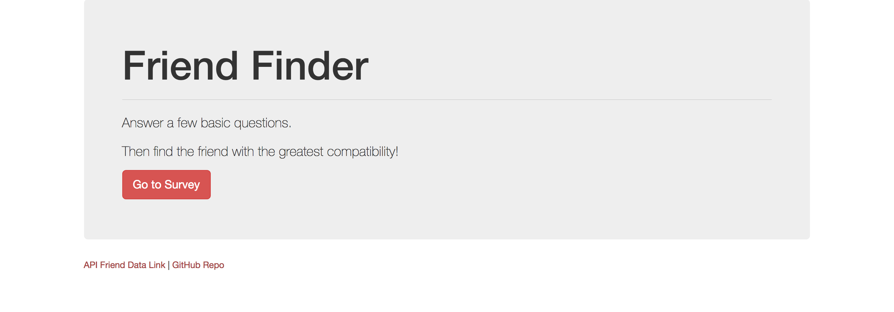
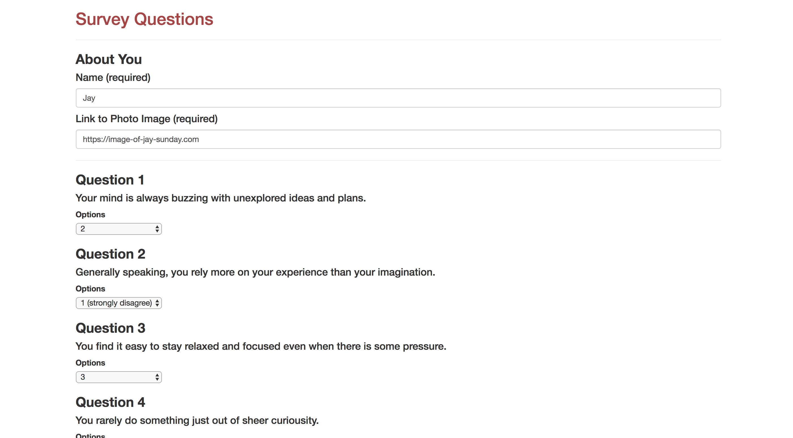

# Friend Finder

This is a compatibility-based friend/dating app. The app takes results from users' answers to the survey and finds their best match.  Check it out!

# Getting Started

- Clone the repository
- `npm install` to get dependencies
- Run `node server.js` to server up the page locally
- View the page in your web browser under the port you specified (on download, set as port 8080)

# Check it Out Here:
https://damp-everglades-20587.herokuapp.com/

# Screenshots

# Built with
- Node.js
- HTML
- CSS
- Bootstrap
- Javascript
- jQuery
- [NPM Express package](https://www.npmjs.com/package/express)
- [NPM Handlebars package](https://www.npmjs.com/package/express-handlebars)
- [NPM Body Parser package](https://www.npmjs.com/package/body-parser)